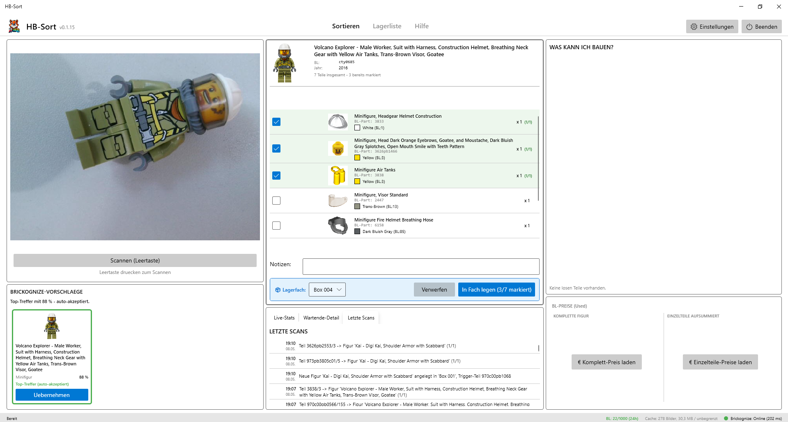
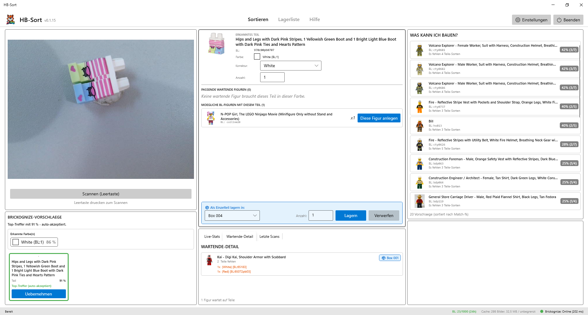
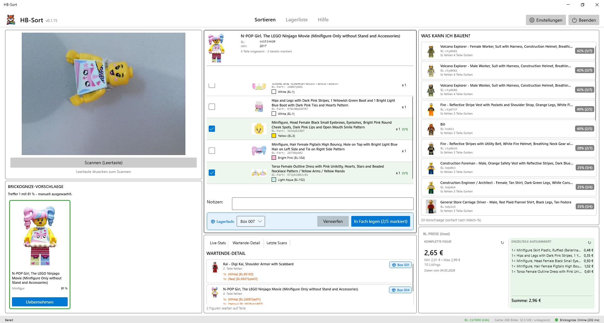
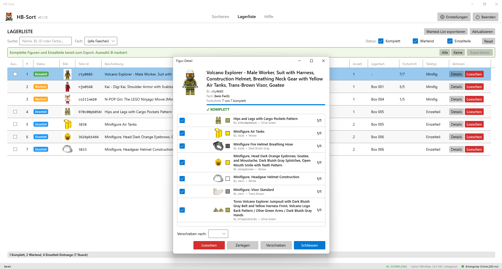
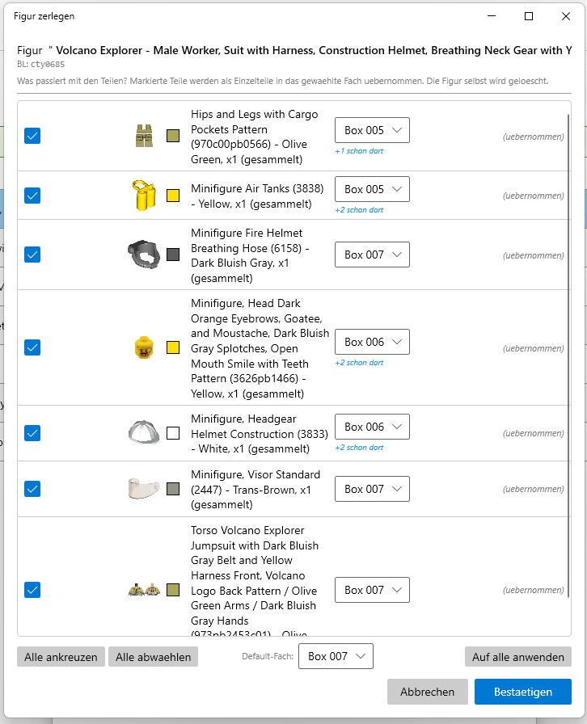

# HB-Sort

Windows-Desktop-App zum Sortieren von Klemmbaustein-Minifiguren und
Einzelteilen. HB-Sort erkennt Teile per USB-Webcam, ordnet sie wartenden
Figuren zu, verwaltet Lagerfaecher und unterstuetzt den Verkauf via
BrickStore- und BrickLink-Export.

> **Disclaimer:** LEGO® ist eine Marke der LEGO-Gruppe, die HB-Sort
> weder sponsert noch unterstuetzt oder anerkennt. HB-Sort ist ein
> unabhaengiges, kostenloses Werkzeug ohne offizielle Verbindung zur
> LEGO-Gruppe.



## Features

- **Webcam-Erkennung** ueber Brickognize-API: Minifiguren und Einzelteile
  inklusive Farbe.
- **Reverse-Match**: gescannte Einzelteile finden automatisch passende
  wartende Figuren; bei vollstaendigem Match wird die Figur als komplett
  markiert.
- **Lagerfaecher-Verwaltung** mit Smart-Storage-Suggestions: gleiches
  Teil + gleiche Farbe wird automatisch ins bestehende Fach gestapelt.
- **"Was kann ich bauen?"-Live-Vorschau** auf Basis deiner gelagerten
  Einzelteile.
- **BrickLink-Preise** (optional, eigener BL-Consumer-Account noetig)
  mit Cache + Stale-While-Revalidate, getrennten TTLs fuer Minifigs/Teile,
  Korrekturfaktoren fuer Verkaufsgebuehren.
- **BSX-Export** fuer BrickStore: komplette Figuren und Einzelteile in
  einer Datei, mit Lagerfach-Information im internen `<Remarks>`-Feld
  und User-Notizen im oeffentlichen `<Comments>`-Feld.
- **Wanted-List-Export** fuer BrickLink (XML pro Figur oder eine grosse
  Datei mit allen fehlenden Teilen).
- **Volle Tastatur-Bedienung** (Leertaste = scannen, Strg+S/L/H =
  Tab-Wechsel, F1 = Hilfe, etc.).
- **Integrierte Hilfe** (F1) mit Markdown-Inhalten.
- **Theming** folgt dem Windows-System-Theme (hell/dunkel).
- **Auto-Update** ueber GitHub Releases (Settings → Updates) - nur bei
  Setup-Installation, Portable-ZIP zeigt den Tab deaktiviert.
- **Auto-BL-Import** (ab v0.1.15, optional) - aktualisiert die BrickLink-
  Stammdaten alle 7/14/30/90 Tage im Hintergrund.
- **Backup-System** (ab v0.1.16) - automatische taegliche Backups deiner
  Daten in `%APPDATA%\HBSort\backups\`. Restore mit Pre-Restore-Backup
  als Sicherheitsnetz, Auto-Neustart der App nach Wiederherstellung.
- **Verlauf + Rueckgaengig** (ab v0.1.16) - Tab "Verlauf" zeigt alle
  Aktionen (Loeschen, Verschieben, Komplettieren, Fach-Aenderungen).
  Strg+Z macht die letzte Aktion rueckgaengig.
- **Bulk-Operationen** (ab v0.1.16) - mehrere Items in der Lagerliste
  markieren und gemeinsam loeschen oder verschieben (mit Undo-Support).
  Doppelklick auf Zeile oeffnet Details, Entf-Taste loescht Selektion.

## Was ist neu in v0.1.18

- **Konsistente Lagerfach-Vorschlaege**: wartende Figuren bekommen ein
  eigenes Fach, Einzelteile vom gleichen Typ landen immer im gleichen
  Fach, Complete-Figuren duerfen sich ein Fach teilen.
- **Maximum Complete-Figuren pro Fach** in den Einstellungen
  konfigurierbar (Default: 5).
- **Live-Anpassung des Lagerfachs**: waehrend du Teile markierst,
  wechselt das vorgeschlagene Lagerfach automatisch - alle Teile da ->
  Complete-Fach, fehlt eins -> Wartend-Fach.
- **Enter-Taste = "In Fach legen"**: kein Maus-Klick mehr noetig - nach
  dem Markieren der Teile einfach Enter druecken.
- **Klare Anweisung wo das Item hin soll**: nach Druck auf Enter oder
  "In Fach legen"-Button erscheint mittig oben ein Hinweis welches
  Fach gemeint ist (mit Bild).

## Was ist neu in v0.1.17

- **Tastatur-Shortcuts fuer Brickognize-Vorschlaege**: nach einem Scan
  kannst du mit den Tasten 1, 2 oder 3 den entsprechenden Vorschlag
  direkt uebernehmen - kein Maus-Klick mehr noetig.
- **Statistik-Dashboard erweitert**: der Live-Stats-Tab zeigt jetzt
  zusaetzlich Lagerfach-Auslastung, Top-5-Faecher mit den meisten Items
  und die letzten Komplettierungen.
- **Beschreibung statt Notizen**: das Notiz-Feld in der Figur-Ansicht
  heisst jetzt "Beschreibung" - der Text landet beim BSX-Export im
  oeffentlichen BL-Comment-Feld und ist fuer Kaeufer sichtbar
  (Hinweise wie "kleiner Riss am Helm" hier eintragen).
- **Einzelteil-Verschieben rueckgaengig**: das Bulk-Verschieben von
  Einzelteilen kann jetzt auch via Strg+Z rueckgaengig gemacht werden.
- **DataHeal-Verbesserung**: bei einer einzelnen verlorenen Lagerfach-
  Zuordnung wird die letzte bekannte Position automatisch wiederhergestellt.
- **Layout-Fix**: die Teile-Liste in der Figur-Ansicht nutzt jetzt den
  verfuegbaren Platz, wenn du den Trenner nach unten ziehst.

## Was ist neu in v0.1.16

- **Backup-System** mit Pending-Restore-Pattern (App startet nach
  Wiederherstellung automatisch neu).
- **Verlauf-Tab + Strg+Z** fuer Undo aller wichtigen Aktionen.
- **Bulk-Loeschen + Bulk-Verschieben** in der Lagerliste, inkl.
  wartender Figuren.
- **EmptyAsync-Warnung**: beim "Fach leeren" wird gewarnt wenn
  komplette Figuren im Bin sind (sie verlieren ihr Lagerfach).
- **Auto-BL-Import optimiert**: HTTP 304 + SHA256-Hash-Check -
  Update-Pruefung dauert jetzt ~50 ms statt 5-10 Min wenn die
  BrickStore-DB unveraendert ist.
- **Quality-of-Life**: Doppelklick oeffnet Details, Entf-Taste
  loescht, Suche findet auch Lagerfach-Labels, Default-Auswahl
  beim Scannen konfigurierbar.

## Screenshots

### Einzelteil-Erkennung mit Reverse-Match



Gescannte Einzelteile werden automatisch wartenden Figuren zugeordnet
(Reverse-Match). Die rechte Seite zeigt mit welchen wartenden Figuren
das Teil kombinierbar ist.

### Lagerliste mit Bulk-Aktionen



Komplette Bestandsuebersicht mit Filtern (Status, Lagerfach,
Volltext-Suche), Multi-Select-Checkboxen und Bulk-Operationen
(ab v0.1.16). Status-Badges zeigen auf einen Blick was komplett,
wartend oder ein Einzelteil ist.

### Figur-Detail



Pro Figur: Status, Teile-Liste mit Bildern, Verschieben in anderes
Fach, Zerlegen-Wizard, Loeschen.

### Figur zerlegen (DismantleWizard)



Beim Zerlegen kannst du pro Teil entscheiden: in den Pool legen, einer
wartenden Figur zuordnen (UX X.25) oder verwerfen.

## Voraussetzungen

- Windows 10 oder 11
- USB-Webcam
- BrickStore-Datenbank: muss beim ersten Start importiert werden ueber
  **Einstellungen → BrickLink → Catalog-Daten → "Von GitHub importieren"**.
  Holt die ~570 MB BrickStore-DB von rgriebl/brickstore-database; ohne
  diesen Schritt kennt HB-Sort die Teile-Stammdaten nicht.
- BrickLink-Consumer-Account (optional, nur fuer Live-Preise und
  Wanted-List-Export)
- Fuer den Source-Build: .NET 8 SDK (https://dotnet.microsoft.com/download)

## Installation

### Aus dem Source bauen

```powershell
git clone https://github.com/rainman19121979/HB-Sort.git
cd HB-Sort
dotnet build -c Release
dotnet run --project HBSort
```

### Setup-Installer (.exe) - empfohlen

Auf jedem GitHub-Release liegt ein `HBSort-Setup.exe`. Das ist ein
schlanker Installer (Velopack-Format) der:

- HB-Sort unter `%LOCALAPPDATA%\HBSort\` ohne Admin-Rechte installiert,
- einen Startmenue-Eintrag anlegt,
- in **Programme & Features** als "HB-Sort" auftaucht (zum
  Deinstallieren),
- **Auto-Update** unterstuetzt: spaetere Versionen werden im Hintergrund
  geladen und beim naechsten Start eingespielt.

**SmartScreen-Warnung beim ersten Start:** weil der Installer aktuell
nicht code-signiert ist, zeigt Windows ein blaues SmartScreen-Fenster
"App von unbekanntem Herausgeber". Klick auf "Weitere Informationen"
und dann "Trotzdem ausfuehren". Das ist normal fuer kostenlose Open-
Source-Hobby-Apps - Code-Signing-Zertifikate kosten 100-300 EUR/Jahr
und sind fuer dieses Projekt aktuell nicht vorgesehen.

Auto-Updates aus der laufenden App heraus haben **keine** SmartScreen-
Warnung mehr - die wird nur beim allerersten Setup-Klick gezeigt.

### Portable ZIP - keine Installation

Auf jedem Release liegt zusaetzlich `HBSort-X.Y.Z-win-x64.zip`. Das ist
ein Self-Contained Single-File-Build:

- Entpacken irgendwohin, `HBSort.exe` doppelklicken.
- Kein Eintrag in Programme & Features.
- **Kein Auto-Update** - neue Versionen musst du selbst herunterladen.
- Lauffaehig ohne .NET-Installation und ohne Admin-Rechte.

Daten landen in beiden Varianten unter `%APPDATA%\HBSort\` und sind
unabhaengig von der App-Installation - du kannst zwischen Setup und
Portable wechseln, ohne deinen Bestand zu verlieren.

## Konfiguration

Beim ersten Start die Tokens unter **Einstellungen → BrickLink** eintragen
(falls Live-Preise oder Wanted-List gewuenscht). Die Tokens werden via
Windows-DPAPI verschluesselt im AppData-Ordner abgelegt - sie sind
ausschliesslich auf demselben Windows-Benutzerprofil entschluesselbar.

Details zu jedem Bereich gibt es in der **integrierten Hilfe** (F1).

## Datenquellen & Drittanbieter

HB-Sort verlaesst sich auf drei externe Datenquellen. Sie sind klar
getrennt und alle bewusst gewaehlt - HB-Sort sammelt selbst keine
Daten zentral.

### Brickognize

- **Wofuer**: Webcam-Bild-basierte Teile- und Minifig-Erkennung (KI-Modell).
- **Link**: https://brickognize.com
- **Hinweis**: HB-Sort schickt nur das aufgenommene Webcam-Bild an die
  Brickognize-API zur Erkennung. Kein Account ist Pflicht fuer die
  Nutzung von HB-Sort - die API ist frei nutzbar mit fairem Rate-Limit.
  Mehr Infos auf brickognize.com.
- **Brickognize-Terms-of-Service**: Mit der Nutzung von HB-Sort
  akzeptierst Du implizit die Terms-of-Service von Brickognize
  (siehe brickognize.com -> "Legal" / "Terms of Service").
  Insbesondere:
  - Brickognize-API ist fuer **persoenliche, nicht-kommerzielle
    Nutzung** gedacht.
  - Hochgeladene Bilder werden gemaess Brickognize-ToS Section 8
    verarbeitet (Lizenz-Grant an Brickognize zur Nutzung der
    hochgeladenen Bilder fuer u.a. Modell-Training).
  - HB-Sort ist nicht von Brickognize betrieben oder finanziert.
    Wenn Du Bedenken hast, schau Dir die ToS an oder verzichte auf
    den Webcam-Erkennungs-Schritt (HB-Sort ist auch nutzbar fuer
    manuelle Item-Eingabe).

  Falls Du HB-Sort kommerziell nutzen willst (z.B. fuer einen Shop):
  bitte direkt an Brickognize wenden, das ist nicht durch die
  HB-Sort-Doku abgedeckt.

### BrickStore-Datenbank (rgriebl/brickstore-database)

- **Wofuer**: Lokale Item-Stammdaten (Minifig-Subsets, Teile-Namen,
  Farben). HB-Sort nutzt die aufbereitete Daten-Pipeline von BrickStore
  von Robert Griebl, weil sie die offiziellen BrickLink-Daten in einem
  nutzbaren XML-Format zur Verfuegung stellt.
- **Link**: https://github.com/rgriebl/brickstore-database
- **Lizenz der Daten**: gemaess BrickStore-DB-Repo (GPL-3 / Daten-
  Lizenzhinweise dort).
- **Wichtig**: HB-Sort verteilt diese Daten NICHT mit. Sie werden beim
  ersten Setup direkt aus dem oben genannten Repo geladen.

### BrickLink-API

- **Wofuer**: Optional - aktuelle Preise (Sold/Stock-Guides) fuer
  gescannte Items.
- **Link**: https://www.bricklink.com/v3/api.page
- **Hinweis**: Erfordert einen eigenen BL-Consumer-Account beim User
  inklusive IP-Whitelist im BL-Profil. HB-Sort selbst sammelt keine
  BL-Daten zentral; alle Calls laufen direkt vom User-PC zur BL-API
  ueber dessen eigene Tokens.

## Tech-Stack

- C# 12 / .NET 8 LTS
- WPF + ModernWpfUI
- MVVM via CommunityToolkit.Mvvm
- EF Core 8 (SQLite) fuer Userdaten
- Microsoft.Data.Sqlite (raw ADO.NET) fuer den BL-Cache
- BricklinkSharp (BL-API, OAuth1)
- OpenCvSharp4 (Webcam)
- Markdig + Markdig.Wpf (Hilfe-Rendering)
- Serilog (Logging)
- Windows DPAPI (Token-Verschluesselung)

## Lizenz

HB-Sort steht unter der **GNU General Public License v3.0** - siehe
[LICENSE](LICENSE).

## Mitwirken

Issues und Pull Requests willkommen. Vor groesseren Aenderungen bitte
ein Issue eroeffnen, damit wir Richtung und Scope abstimmen koennen.

## Entwicklungs-Hinweis

Developed with AI assistance.
